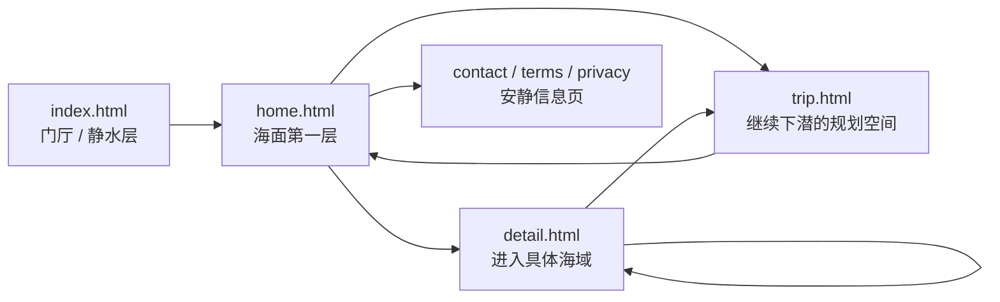
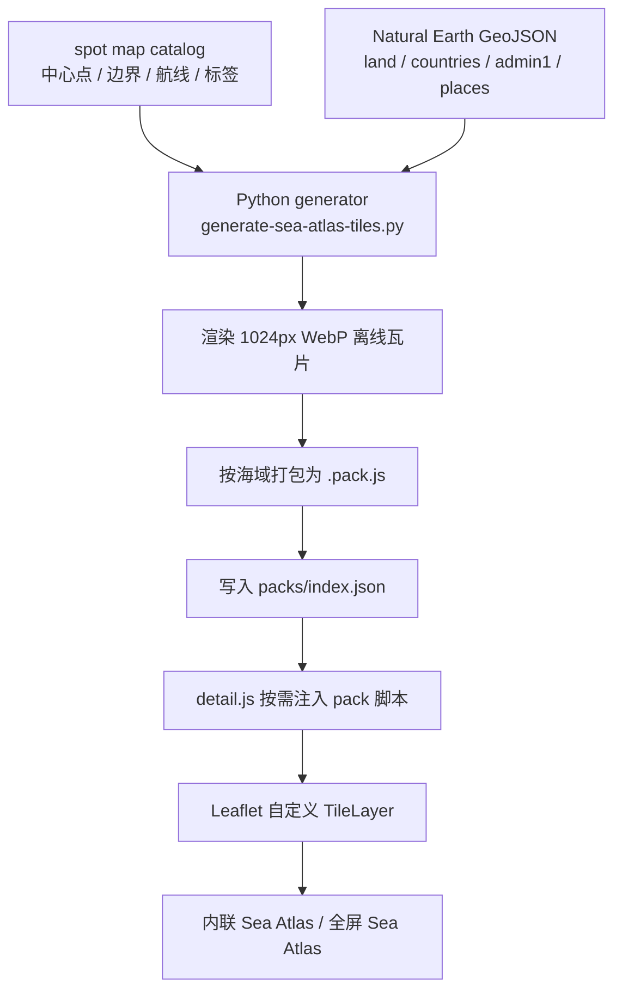
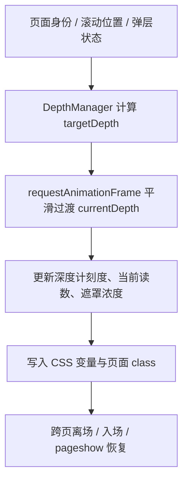

# 盐憩 · YANQI

<div align="center">
  <p><strong>一个把潜水旅游做成海层叙事的多页面前端项目</strong></p>
  <p>让用户像在同一片海里慢慢下潜、停驻、再继续向更深处移动，而不是在几张普通网页之间普通跳转。</p>

  <p>
    
    
    
    
    
    
  </p>

  <p>
    <a href="#overview">项目总览</a> ·
    <a href="#experience">页面层级</a> ·
    <a href="#architecture">主题框架</a> ·
    <a href="#sea-atlas">地图系统</a> ·
    <a href="#depth-gauge">深度计系统</a> ·
    <a href="#run">运行方式</a> ·
    <a href="#structure">目录结构</a>
  </p>
</div>

> 盐憩不是普通旅游信息站，也不是工具型预订平台。  
> 它更像一个带有品牌气质、海洋叙事感、空间层级感和慢节奏浏览体验的网页项目。

<a id="overview"></a>
## 项目总览

盐憩的核心目标，不是把潜水信息“排成列表”，而是把“进入海、理解海、收进行程”这件事做成一个连续体验。

这个仓库当前已经完成了门厅页、首页、行程页、详情页和信息页，也完成了跨页深度切换、行程本地状态续接、详情页套餐确认闭环，以及离线 Sea Atlas 地图系统。

| 维度 | 说明 |
| --- | --- |
| 品牌名 | 盐憩 |
| 网站主题 | 潜水旅游 |
| 项目定位 | 以前端展示与交互叙事为主，不走电商站、后台站、工具站路线 |
| 关键词 | 深海、安静、高级、舒缓、沉浸、有呼吸感 |
| 视觉语言 | 深海蓝、海盐白、低饱和青蓝、玻璃感、雾感、柔和模糊、微发光 |
| 当前形态 | 多页面静态站点，状态以 `localStorage` / `sessionStorage` 为主 |
| 技术重心 | 叙事型 UI、跨页过渡、深度计系统、离线海图、原生交互组织 |

### 这个项目已经做了什么

- 完成 `index.html`、`home.html`、`trip.html`、`detail.html`、`contact.html`、`terms.html`、`privacy.html` 的整站页面。
- 把跨页跳转做成“下潜 / 上浮 / 潜游”三类海层变化，而不是普通 fade。
- 做了整站深度计，让页面层级、滚动和弹层都能联动到同一套深度语言。
- 做了详情页 Sea Atlas 海图，不是截图占位，而是本地生成、按海域打包、运行时按需加载的离线海图。
- 做了详情页和行程页之间的共享行程存储，让套餐确认后可以继续在行程页整理。
- 做了首页推荐、潜水匹配、海图导览、相关推荐、联系表单草稿等完整前端交互。
- 做了地图构建报告、首屏拼图校验、页面性能烟雾测试和图片优化脚本。

### 为什么它不是普通旅游网站

- 页面关系按“海层深浅”来设计，不按“导航栏目”来设计。
- 组件优先服从品牌语境，而不是先套标准 UI。
- 行程页不是普通表单页，而是更深一层、更安静的规划空间。
- 详情页不是信息堆叠页，而是进入一片具体海域后的阅读、确认和停驻空间。
- 地图不是外部在线地图嵌入，而是项目自己的离线海图舞台。

<a id="experience"></a>
## 页面层级与海层关系



### 页面职责

- `index.html`：进入盐憩之前的门厅，负责建立进入感和静水感。
- `home.html`：海面的第一层，先让用户看海、被海吸引，再慢慢进入内容。
- `trip.html`：更深一层的规划空间，负责把一片海收进行程。
- `detail.html`：真正进入某片海域后的阅读与确认空间。
- 信息页：维持同一世界观下的安静说明层，而不是单独拎出来的普通文档页。

### 跳转语义

- `index -> home`：像从岸上进入海面。
- `home -> trip`：像继续下潜。
- `trip -> home`：像缓慢上浮。
- `detail -> detail`：像在相邻海域之间平移潜游。

<a id="architecture"></a>
## 主题框架 / Theme Framework

盐憩不是“几张页面 + 几个模块”的堆叠，而是一个由品牌层、空间层、内容层、状态层共同组成的前端框架。

| 层级 | 作用 | 关键文件 |
| --- | --- | --- |
| 品牌层 | 统一颜色、雾感、玻璃感、留白、文案气质和品牌链接 | [`site/css/global.css`](site/css/global.css), [`site/js/yanqi-brand-config.js`](site/js/yanqi-brand-config.js) |
| 空间层 | 定义页面深浅、滚动深度、跨页潜浮、遮罩层和深度计显示 | [`site/js/depth-manager.js`](site/js/depth-manager.js), [`site/css/depth-gauge.css`](site/css/depth-gauge.css), [`site/css/page-transition.css`](site/css/page-transition.css) |
| 内容层 | 管理潜点目录、海图目录、详情页数据、评论内容和品牌配置 | [`site/js/yanqi-spot-catalog.js`](site/js/yanqi-spot-catalog.js), [`site/js/yanqi-spot-map-catalog.js`](site/js/yanqi-spot-map-catalog.js), [`site/js/detail-spot-data-manifest.js`](site/js/detail-spot-data-manifest.js), [`site/js/detail-spot-data/`](site/js/detail-spot-data/) |
| 状态层 | 处理行程草稿、确认套餐、跨页返回目标、深度续接和临时弹层状态 | [`site/js/yanqi-trip-store.js`](site/js/yanqi-trip-store.js), [`site/js/trip.js`](site/js/trip.js), [`site/js/detail.js`](site/js/detail.js) |
| 布局层 | 通过 `pretext` 预测多行文本高度，减少卡片和文案区跳动 | [`site/js/text-layout-adapter.js`](site/js/text-layout-adapter.js), [`site/pretext-main/`](site/pretext-main/) |

### 主题框架的实现思路

1. 先把品牌气质抽成基础底盘  
   颜色、阴影、雾感、模糊、按钮基线、导航基线都从全局样式层统一控制。

2. 再把页面关系做成空间语言  
   首页、行程页、详情页不是平级导航页，而是有深浅关系的海层。

3. 再把内容模块变成世界观内的组件  
   搜索、推荐、地图、浮层、页脚都要服从“盐憩”的海洋叙事，而不是套用普通组件范式。

4. 最后才补状态与数据闭环  
   让套餐确认、行程草稿、跨页返回、地图加载这些行为保持连续。

## 核心技术栈

| 类别 | 使用内容 | 在项目中的作用 |
| --- | --- | --- |
| 页面结构 | `HTML` 多页面结构、语义化区块、`data-*` | 组织门厅、首页、行程、详情与信息页 |
| 视觉表达 | `CSS`、`Grid`、`Flex`、`clamp()`、渐变、模糊、玻璃感 | 建立深海、静谧、雾感和空间层次 |
| 交互开发 | 原生 `JavaScript`、事件委托、`Map`、`Set`、`URLSearchParams` | 管理页面逻辑、切换、筛选、状态与导航 |
| 动画节奏 | `requestAnimationFrame`、CSS 变量、关键帧动画 | 实现滚动深浅变化和跨页潜浮体验 |
| 观察能力 | `IntersectionObserver`、`ResizeObserver` | 管理模块入场、懒加载、尺寸同步、地图触发 |
| 状态存储 | `localStorage`、`sessionStorage` | 保存行程草稿、确认套餐、深度状态和临时 UI 状态 |
| 地图系统 | `Leaflet` + 自定义离线 `TileLayer` | 详情页 Sea Atlas 内联地图与全屏地图 |
| 地图生成 | `Python`、`Pillow`、Natural Earth GeoJSON | 把海域范围渲染成项目内离线海图包 |
| 质量校验 | `Node.js`、`Playwright`、`sharp` | 做页面烟雾测试、地图构建报告、拼图验证和图片优化 |
| 文本布局 | `pretext` | 预测多行文本高度，减少动态内容跳动 |

<a id="sea-atlas"></a>
## Sea Atlas 地图系统

这次 README 的重点之一，就是把地图系统讲清楚。

盐憩里的地图不是直接调用在线公开底图，也不是在设计稿里截一张图贴上去。它是一套项目内自建的离线海图系统：

- 每片海域在 [`site/js/yanqi-spot-map-catalog.js`](site/js/yanqi-spot-map-catalog.js) 里有自己的 `mapCenter`、`mapBounds`、`zoom`、航线控制点、港口坐标和上下文标签。
- [`tools/maps/generate-sea-atlas-tiles.py`](tools/maps/generate-sea-atlas-tiles.py) 会根据这些范围，结合本地 Natural Earth GeoJSON 数据，生成离线瓦片。
- 这些瓦片不会散成一堆图片文件，而是被打成按海域拆分的 `.pack.js` 脚本包，并登记进 [`site/assets/maps/packs/index.json`](site/assets/maps/packs/index.json)。
- 详情页在真正滚动到海图区之前，不会提前请求 Leaflet 和地图 pack；等海图区进入视口后，才会按需加载。
- 运行时通过自定义 `TileLayer` 把 Base64 WebP 瓦片还原成 `data:` URL，再交给 Leaflet 渲染。

### 地图制作原理



### 地图的具体生成流程

1. 在海域目录里定义数据  
   `yanqi-spot-map-catalog.js` 负责给每片海域补齐离线地图所需字段，例如包路径、缩放区间、标签与初始视图模式。

2. 读取本地地理数据源  
   生成器优先读取 `tools/maps/source/natural-earth/` 下的 GeoJSON：
   - `ne_10m_land.geojson`
   - `ne_10m_admin_0_countries.geojson`
   - `ne_10m_admin_1_states_provinces.geojson`
   - `ne_10m_populated_places.geojson`

3. 扩展海域边界，留出安全缓冲  
   脚本会在原始 `mapBounds` 之外再做经纬度扩展，并额外按瓦片行列加 buffer，避免海图舞台刚好卡死在边缘。

4. 把经纬度换算成 Web Mercator 瓦片坐标  
   生成器内部有 `lon_to_tile_x()`、`lat_to_tile_y()`、`project_lon_lat()` 等函数，把地理坐标映射到瓦片像素坐标。

5. 使用 Pillow 绘制底图  
   每个瓦片都会先画海色渐变和经纬网，再叠加陆地、多级边界和上下文标签。海图里“海”的气质不是靠外部主题包，而是在生成阶段直接画出来。

6. 输出为高密度离线瓦片  
   当前脚本固定使用 `1024px` 瓦片尺寸，并在运行时保持 `zoomOffset: -2`，这样细节密度更高，视觉更稳。

7. 按海域写成脚本包  
   不是把瓦片散在目录里，而是把一片海域的所有瓦片写进一个 `.pack.js`，运行时注入一次脚本就能挂到全局 registry。

### 地图运行时原理

- `detail.js` 先懒加载 `Leaflet`，避免详情页首屏就背上地图体积。
- 再通过 `loadSeaAtlasTilePackArchive()` 注入当前海域的 pack 脚本。
- pack 脚本把数据写到 `window.__YANQI_SEA_ATLAS_PACKS__`。
- 自定义 `TileLayer` 在 `createTile()` 里按 `z/x/y.webp` 找到 Base64 数据，转成 `data:image/webp;base64,...` 提供给 Leaflet。
- 航线本身不是烘焙进底图，而是叠加在地图舞台上的 SVG 路线层，这样路线能保留动势和光感，也更容易在内联 / 全屏之间复用。

<details>
<summary><strong>查看地图相关关键代码片段</strong></summary>

生成器如何把瓦片打进单个海域包：

```python
for z in range(storage_min_zoom, storage_max_zoom + 1):
    x_start, x_end, y_start, y_end = tile_range_for_bounds(bounds, z)
    for x in range(x_start, x_end + 1):
        for y in range(y_start, y_end + 1):
            tile_bytes = render_tile_bytes(prepared, prepared["context_labels"], spot, z, x, y)
            tile_payload[f"{z}/{x}/{y}.webp"] = base64.b64encode(tile_bytes).decode("ascii")

pack_script = (
    "(function registerSeaAtlasPack(global) {\n"
    "    const registry = global.__YANQI_SEA_ATLAS_PACKS__ = global.__YANQI_SEA_ATLAS_PACKS__ || Object.create(null);\n"
    f"    registry[{json.dumps(key)}] = {json.dumps(pack_record, ensure_ascii=False, separators=(',', ':'))};\n"
    "})(window);\n"
)
```

详情页如何按需加载 pack：

```js
async function loadSeaAtlasTilePackArchive(packPath, packFormat = 'script') {
    const registryKey = getSeaAtlasPackRegistryKey(packPath);
    const registry = getSeaAtlasPackRegistry();
    if (registry[registryKey]) {
        return buildSeaAtlasScriptPackArchive(packPath, registry[registryKey]);
    }

    await new Promise((resolve, reject) => {
        const script = document.createElement('script');
        script.src = packPath;
        script.async = true;
        script.setAttribute('data-sea-atlas-pack', packPath);
        script.addEventListener('load', resolve, { once: true });
        script.addEventListener('error', reject, { once: true });
        document.head.appendChild(script);
    });

    return buildSeaAtlasScriptPackArchive(packPath, registry[registryKey]);
}
```

Leaflet 自定义离线瓦片层：

```js
SeaAtlasPackedTileLayerClass = window.L.TileLayer.extend({
    initialize(packPath, packFormat, options = {}) {
        this._seaAtlasPackPath = packPath;
        this._seaAtlasPackFormat = packFormat || 'script';
        window.L.TileLayer.prototype.initialize.call(this, '', options);
    },

    createTile(coords, done) {
        resolveSeaAtlasPackedTileUrl(this._seaAtlasPackPath, this._seaAtlasPackFormat, coords)
            .then((tileUrl) => {
                tile.src = tileUrl || SEA_ATLAS_EMPTY_TILE_DATA_URI;
                done(null, tile);
            })
            .catch((error) => done(error, tile));
        return tile;
    }
});
```

</details>

### 地图相关文件

- [`site/js/yanqi-spot-map-catalog.js`](site/js/yanqi-spot-map-catalog.js)：海域地图目录，定义每片海的视图边界、航线和离线 pack 信息。
- [`site/assets/maps/packs/`](site/assets/maps/packs/)：离线海图包输出目录。
- [`site/assets/maps/README.md`](site/assets/maps/README.md)：地图资源的简要说明。
- [`tools/maps/generate-sea-atlas-tiles.py`](tools/maps/generate-sea-atlas-tiles.py)：离线海图生成脚本。
- [`tools/maps/source/natural-earth/`](tools/maps/source/natural-earth/)：本地地理数据源。
- [`tools/qa/sea-atlas-build-report.cjs`](tools/qa/sea-atlas-build-report.cjs)：生成地图构建报告。
- [`tools/qa/sea-atlas-first-view-mosaic.cjs`](tools/qa/sea-atlas-first-view-mosaic.cjs)：把首屏视角拼成 QA 拼图。

### 为什么用这套方案

- 可以保持视觉风格统一，不受第三方在线底图风格限制。
- 可以离线展示海域关系，不依赖外部 tile 服务。
- 可以把底图、路线、说明卡、全屏舞台收成同一个体验系统。
- 方便后续继续把更多海域扩进去，而不是每次手工截图。

<a id="depth-gauge"></a>
## 深度计系统

深度计不是装饰，它是整站空间语言的一部分。

它负责把“你现在在盐憩的哪一层海里”这件事可视化，同时把跨页切换、页面滚动、弹层打开与关闭这些行为都翻译成连续的深浅变化。

### 深度计解决了什么问题

- 让首页、行程页、详情页拥有明确的海层深浅关系。
- 让滚动不是简单地往下刷，而是“继续下潜”。
- 让 `home -> trip`、`trip -> home`、`detail -> detail` 的跳转拥有不同语义。
- 让弹层打开时不是单独叠一层，而是“进入更深一层”。
- 让浏览器前进 / 后退时，深度和遮罩也能跟着恢复，而不是突然断掉。

### 深度计的核心机制

1. 先定义页面基准深度  
   `depth-manager.js` 用 `PAGE_DEPTH_MAP` 给每个页面定一个基础深度。

2. 再定义页面内部的滚动停靠点  
   首页使用 `HOME_SECTION_DEPTH_STOPS`，行程页和详情页使用 `PAGE_SCROLL_DEPTH_STOP_MAP`。

3. 用动画把“当前深度”连续地写到 UI 上  
   逻辑深度会被渲染成深度计刻度带位置、当前深度数字、遮罩强度和页面过渡变量。

4. 用 `sessionStorage` 续接跨页状态  
   跳页前写入当前深度、目标页、视觉方向和过渡参数；目标页加载或 `pageshow` 时再接回来。

5. 用观察器感知浮层和页面状态  
   详情页的套餐弹层、评论浮层、灯箱等打开时，会通过页面状态规则再往更深一层轻推。

6. 详情页还做了“逻辑深度 -> 显示潜深”的二次映射  
   所以详情页深度计不是死板显示 `-54` 这类页面逻辑值，而是映射成更接近真实潜深读数的显示。

### 深度计的实现路径



<details>
<summary><strong>查看深度计相关关键代码片段</strong></summary>

页面基础深度：

```js
const PAGE_DEPTH_MAP = Object.freeze({
    login: 0,
    contact: -4,
    terms: -4,
    privacy: -4,
    home: -12,
    trip: -42,
    detail: -54
});
```

首页滚动停靠点：

```js
const HOME_SECTION_DEPTH_STOPS = Object.freeze([
    { selector: '#hero-home', depth: PAGE_DEPTH_MAP.home },
    { selector: '#featured-destinations', depth: -20 },
    { selector: '#dive-match', depth: -28 },
    { selector: '#why-yanqi', depth: -36 },
    { selector: '.footer', depth: -42 }
]);
```

行程页 / 详情页滚动停靠点：

```js
const PAGE_SCROLL_DEPTH_STOP_MAP = Object.freeze({
    trip: [
        { selector: '#trip-top', depth: PAGE_DEPTH_MAP.trip },
        { selector: '#plannerDeskControl', depth: -45 },
        { selector: '#plannerSummary', depth: -48 },
        { selector: '#trip-layer', depth: -52 },
        { selector: '#trip-prep', depth: -56 },
        { selector: '#tripFooter', depth: MIN_DEPTH }
    ],
    detail: [
        { selector: '#detailHero', depth: PAGE_DEPTH_MAP.detail },
        { selector: '#spotOverview', depth: -56 },
        { selector: '#spotMapSection', depth: -57.5 },
        { selector: '#spotReviews', depth: -58.8 },
        { selector: '#relatedSpots', depth: -59.4 },
        { selector: '#detailFooter', depth: MIN_DEPTH }
    ]
});
```

跨页导航时如何接管站内跳转：

```js
navigateTo(rawUrl, options = {}) {
    // 计算 fromPage / toPage / visualDirection / toDepth
    // 写入 sessionStorage
    // 添加离场 class
    // 到时机后跳转到目标页面
}
```

</details>

### 深度计样式层做了什么

[`site/css/depth-gauge.css`](site/css/depth-gauge.css) 负责把逻辑深度变成可视化仪表：

- 两侧固定深度计，让“海层语言”始终存在，而不是只属于某个 section。
- 刻度带通过 `--depth-gauge-step-size`、`--depth-gauge-tape-offset`、`--depth-gauge-shift` 等变量滑动。
- 当前深度数字会根据深度和页面状态调整透明度、发光和位移。

[`site/css/page-transition.css`](site/css/page-transition.css) 则负责：

- 海洋遮罩层
- 潜浮式出入场动画
- 登录门厅到首页的特殊蓝层与气泡动画
- 页面整体平移、缩放、透明度和海水浓度变化

## 状态管理与体验续接

盐憩虽然还没有接真实后端，但页面之间并不是断开的。

### 这里用了哪些状态能力

- `localStorage`
  - 保存登录相关演示状态
  - 保存行程草稿与已确认套餐
  - 保存舞台尺寸、调试开关等本地偏好

- `sessionStorage`
  - 保存当前深度与跨页导航状态
  - 保存详情页之间切换的过渡方向
  - 保存弹层编辑草稿、回首页的滚动目标等短生命周期状态

### 关键文件

- [`site/js/yanqi-trip-store.js`](site/js/yanqi-trip-store.js)：统一行程页与详情页的共享存储。
- [`site/js/trip.js`](site/js/trip.js)：把海域、日期、人数、摘要和已收进行程联动起来。
- [`site/js/detail.js`](site/js/detail.js)：负责套餐确认、相关推荐切换、地图舞台和确认反馈层。

## 这个项目运用了哪些知识

如果把盐憩当成一个前端练习项目来看，它练到的不是单点 API，而是一整套前端能力如何围绕同一个主题协同。

### 1. 页面结构与语义化

- 用多页面结构承接不同海层。
- 用明确的 section 和 `data-*` 把结构、样式和逻辑解耦。
- 把门厅、首页、行程页、详情页、信息页做出清晰职责边界。

### 2. 样式系统与视觉表达

- 用统一变量控制颜色、玻璃感、圆角、留白和阴影。
- 用模糊、渐变、叠层光感和半透明面组织深海气质。
- 用页面级样式文件保持每一层海的气质差异。

### 3. 原生交互开发

- 原生 `JavaScript` 完成复杂页面交互，而不是依赖重型框架。
- 用类、工具函数、共享配置与数据目录组织脚本。
- 用事件委托管理按钮、卡片、弹层、标签切换和地图舞台行为。

### 4. 观察器与动画

- `IntersectionObserver`：模块入场、图片 / 地图懒加载、相关推荐和评论区域触发。
- `ResizeObserver`：同步布局变化，避免地图和深度计错位。
- `requestAnimationFrame`：深度动画、价格动效、舞台变化等需要逐帧平滑处理的部分。

### 5. 本地状态与跨页连续性

- `localStorage` 负责较长生命周期的状态。
- `sessionStorage` 负责当前浏览链路中的临时状态。
- 没有后端时，仍然尽量保证“用户刚刚做过的事”能被下一个页面接住。

### 6. 地图与离线资源工程

- 学到了 `Leaflet` 的地图舞台组织方式。
- 学到了 Web Mercator 瓦片坐标转换的基本原理。
- 学到了如何用 `Python + Pillow + GeoJSON` 自己生成离线地图资源。
- 学到了如何把资源包从“生成阶段”接到“前端运行时”。

### 7. 文本布局预测

- [`site/js/text-layout-adapter.js`](site/js/text-layout-adapter.js) 封装了 `pretext` 的布局预测能力。
- 目的是提前估算多行文本高度，减少相关推荐、卡片标题等动态内容因为字数不同产生的跳动。
- 这让页面在“安静”“缓慢”的气质上更稳，不会因为布局忽高忽低而破坏呼吸感。

<a id="structure"></a>
## 目录结构

```text
盐憩/
├─ site/
│  ├─ assets/
│  │  ├─ images/                   页面图片与海域素材
│  │  ├─ maps/
│  │  │  ├─ packs/                 离线 Sea Atlas pack 与索引
│  │  │  └─ README.md              地图资源简要说明
│  │  └─ vendor/leaflet/           Leaflet 依赖
│  ├─ css/
│  │  ├─ global.css                全站视觉底盘
│  │  ├─ depth-gauge.css           深度计样式
│  │  ├─ page-transition.css       潜浮式跨页过渡
│  │  ├─ home.css                  首页样式
│  │  ├─ trip.css                  行程页样式
│  │  ├─ detail.css                详情页样式
│  │  ├─ login.css                 门厅页样式
│  │  └─ info-pages.css            信息页样式
│  ├─ js/
│  │  ├─ depth-manager.js          整站深度与跨页总控
│  │  ├─ home.js                   首页交互
│  │  ├─ trip.js                   行程页交互
│  │  ├─ detail.js                 详情页交互与 Sea Atlas 运行时
│  │  ├─ yanqi-trip-store.js       行程共享存储
│  │  ├─ yanqi-brand-config.js     品牌链接与兜底图生成
│  │  ├─ yanqi-spot-map-catalog.js 海域地图目录
│  │  ├─ detail-spot-data/         每片海域的详情数据
│  │  └─ text-layout-adapter.js    pretext 文本布局适配器
│  ├─ pretext-main/                文本布局预测依赖
│  ├─ index.html                   门厅页
│  ├─ home.html                    首页
│  ├─ trip.html                    行程页
│  ├─ detail.html                  详情页
│  ├─ contact.html                 联系页
│  ├─ terms.html                   用户协议页
│  └─ privacy.html                 隐私政策页
├─ docs/
│  ├─ QUICKSTART.md                快速启动
│  ├─ YANQI_PRESENTATION.md        展示提纲
│  ├─ YANQI_5MIN_SPEECH.md         五分钟讲解稿
│  └─ YANQI_HANDOFF.md             续接说明
├─ tools/
│  ├─ maps/
│  │  ├─ source/natural-earth/     本地地图 GeoJSON 数据
│  │  └─ generate-sea-atlas-tiles.py
│  ├─ qa/
│  │  ├─ detail-perf-smoke.cjs
│  │  ├─ pages-perf-smoke.cjs
│  │  ├─ sea-atlas-build-report.cjs
│  │  ├─ sea-atlas-first-view-mosaic.cjs
│  │  └─ optimize-images.cjs
│  └─ text-layout/
│     └─ build-local-pretext.cjs   本地 pretext 构建脚本
├─ AGENTS.md
└─ README.md
```

<a id="run"></a>
## 运行方式

### 1. 直接浏览

双击 [`site/index.html`](site/index.html) 可以先看基础页面效果。

### 2. 推荐方式：本地静态服务

更推荐用本地静态服务运行，因为脚本路径、地图 pack、懒加载资源和跨页行为会更稳定。

```bash
cd C:\Users\桉桉\Desktop\盐憩
python -m http.server 8000
```

浏览器打开：

```text
http://localhost:8000/site/
```

### 3. VS Code / Live Server

直接对 [`site/index.html`](site/index.html) 使用 Live Server 也可以。

## 地图重建与 QA

### 生成离线 Sea Atlas

前置依赖：

```bash
pip install pillow requests
```

生成所有海域地图：

```bash
python tools/maps/generate-sea-atlas-tiles.py --all --workers auto
```

只重建某一片海域：

```bash
python tools/maps/generate-sea-atlas-tiles.py --spot mabul
python tools/maps/generate-sea-atlas-tiles.py --spot sipadan
```

### 地图 QA 与构建报告

```bash
cd tools/qa
npm install
```

生成首屏拼图，检查海图首屏覆盖是否合理：

```bash
npm run qa:atlas:mosaic -- --spot mabul
```

生成地图构建报告，记录 pack 变化、输出体积和生成耗时：

```bash
npm run qa:atlas:build-report -- --run -- --spot mabul
```

运行详情页性能烟雾测试：

```bash
npm run perf:detail
```

运行页面性能烟雾测试：

```bash
npm run perf:pages
```

### 文本布局依赖重建

如果需要重建本地 `pretext` 产物：

```bash
node tools/text-layout/build-local-pretext.cjs
```

## 建议的体验顺序

1. 打开 [`site/index.html`](site/index.html)，先进入门厅。
2. 进入 [`site/home.html`](site/home.html)，感受首页的海面层级、推荐和潜水匹配。
3. 从首页进入 [`site/detail.html`](site/detail.html)，看海域阅读、套餐、评论和 Sea Atlas。
4. 在详情页确认一个套餐，再进入 [`site/trip.html`](site/trip.html) 看状态是否被接住。
5. 最后查看 [`site/contact.html`](site/contact.html) 与信息页，确认项目气质是否一致。

<a id="reading"></a>
## 建议的读码顺序

如果想快速抓住项目主线，建议按这个顺序看：

1. [`site/js/depth-manager.js`](site/js/depth-manager.js)  
   先理解整站空间逻辑，知道海层是怎么成立的。

2. [`site/css/page-transition.css`](site/css/page-transition.css) + [`site/css/depth-gauge.css`](site/css/depth-gauge.css)  
   再看视觉层如何把深度逻辑转成遮罩、刻度和潜浮动效。

3. [`site/js/home.js`](site/js/home.js) + [`site/css/home.css`](site/css/home.css)  
   看首页如何负责“海面的第一层”。

4. [`site/js/trip.js`](site/js/trip.js) + [`site/js/yanqi-trip-store.js`](site/js/yanqi-trip-store.js)  
   看行程页如何接住详情页确认过来的内容。

5. [`site/js/detail.js`](site/js/detail.js) + [`site/css/detail.css`](site/css/detail.css)  
   看详情页如何把阅读、套餐、评论、地图和确认反馈收成一套完整体验。

6. [`site/js/yanqi-spot-map-catalog.js`](site/js/yanqi-spot-map-catalog.js) + [`tools/maps/generate-sea-atlas-tiles.py`](tools/maps/generate-sea-atlas-tiles.py)  
   最后再看地图目录和离线海图生成，理解它为什么不是普通嵌入地图。

7. [`site/js/text-layout-adapter.js`](site/js/text-layout-adapter.js)  
   如果想继续往细处看，再理解文本布局为什么会更稳。

## 相关文档

- [`docs/QUICKSTART.md`](docs/QUICKSTART.md)：最短启动路径。
- [`docs/YANQI_PRESENTATION.md`](docs/YANQI_PRESENTATION.md)：项目展示提纲。
- [`docs/YANQI_5MIN_SPEECH.md`](docs/YANQI_5MIN_SPEECH.md)：五分钟讲解版本。
- [`docs/YANQI_HANDOFF.md`](docs/YANQI_HANDOFF.md)：后续接手或继续开发时的续接说明。

## 当前状态与后续方向

### 当前状态

- 已经形成完整的多页面前端体验闭环。
- 深度计、跨页过渡、行程共享状态和 Sea Atlas 已经接成主线。
- 项目重点在“体验和结构已成立”，不是“功能型平台已完工”。

### 后续可继续完善的方向

- 接入真实后端，让账号、留言、行程和套餐确认真正持久化。
- 继续扩充更多海域数据、离线海图和路线信息。
- 拆分详情页里更大的脚本模块，进一步提高可维护性。
- 继续细化移动端节奏、触控细节和地图舞台适配。

## 致谢

- [Leaflet](https://leafletjs.com/)：详情页地图舞台基础能力。
- [Natural Earth](https://www.naturalearthdata.com/)：离线海图生成所使用的地理数据源。
- `pretext`：用于多行文本布局预测的本地依赖。

---

如果把盐憩看作一次完整的前端练习，它练到的不只是 `HTML / CSS / JavaScript` 的基础写法，更重要的是：

- 如何把一个主题做成完整世界观；
- 如何让多个页面拥有同一种海层语言；
- 如何让状态、地图、动效和文案朝同一个方向工作；
- 如何在没有后端的前提下，仍然把浏览体验接成连续的一段海。
